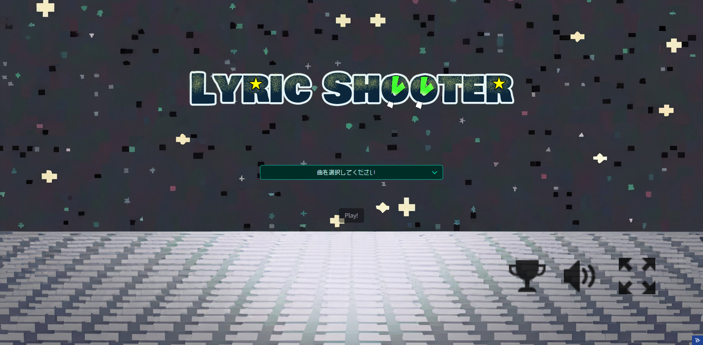

## URL
- https://uroto.github.io/Lyric_Shooter/

## デモ
- 

## 概要
歌詞弾幕に攻撃していくシューティングアプリです！  
リズムに乗りながら攻撃を出して、攻撃弾幕と歌詞弾幕できれいなPVが作られていきます...!
### 遊び方
1. ステージ選択(曲洗濯)

- stage1(SUPERHERO / めろくる)
- stage2(いつか君と話したミライは / タケノコ少年)
- ???(隠しステージあり)

2. playボタンでスタート  
各ステージでのプレイ方法
- stage1
  - Wまたは左矢印キーで左へ移動
  - Aまたは右矢印キーで右へ移動
  - spaceキーでジャンプ
  - マウス左(マウスパッド)クリックで弾幕発射
- stage2
  - Wまたは上矢印キーで上へ移動
  - Aまたは左矢印キーで左へ移動
  - Dまたは右矢印キーで右へ移動
  - Sまたは下矢印キーで下へ移動
  - マウス左(マウスパッド)クリックで弾幕発射
- ???
  - 弾幕とプレイヤーが当たる瞬間にクリックでスコアアップ
### 対応楽曲
- SUPERHERO / めろくる
- いつか君と話したミライは / タケノコ少年
- リアリティ / 歩く人

## こだわり
目立たない細かい機能やデザインの実装にこだわりました！  
以下にこだわりを列挙しておきます。
- 歌詞弾幕の消し方
  - stage1:時間経過での削除(二秒前に点滅)
  - stage2:壁に当たることでの削除
  - 隠しステージ：プレイヤーに当たることで削除
- フォントの変更
  - 通常：mihiPixelmoji
  - stage1:シャープ旧ロゴ
  - stage2:まるこいあす
  - 隠しステージ：全員集合！ポップ体
- プレイヤーの操作性
  - stage1：物理演算による重力蟻のプレイ
  - stage2：物理演算なしのに浮いている状態のプレイ
  - 隠しステージ：プレイヤーが動かずにクリックのみ
- スコア画面
  - 各スコアが増えるごとにスコア表が大きくなり画面サイズを超えるとスクロール可能
- ロード画面
  - viteで高速にロード可能だが、実はロード画面ではちゅねミクが動いている
- リサイズへの対応
  - 操作的にPC対象ゲームだが、PCでもブラウザの画面リサイズに対応可能
  - フルスクリーン対応
- 画面デザイン/素材
  - 一部外部利用したものもあるが、それ以外は全て自作で素材作成しました！

## 対象デバイス/対象環境
### デバイス
- PC(windows/mac)
### 検証済みブラウザ
- Google Chrome
- Safari
- Firefox
- Microsoft Edge

## 実行方法

1. ソースコードのダウンロード
```
git clone https://github.com/Uroto/Lyric_Shooter.git
```
2. プロジェクト階層へ移動
```
cd ./Lyric_Shooter
```
3. パッケージインストール
```
npm install
```
4. 環境変数の設定  
.envファイルのテンプレートから.envファイルを作成  
※開発者用APIを取得して設定してください
```
cp .env.example .env
```
```
VITE_YOUTUBE_API_KEY="開発者用のText Alive API Key"
```
5. 開発サーバー起動
```
npm run dev
```
※ビルドとプレビュー
```
npm run build
npm run preview
```

## 最後に
最後まで見てくださってありがとうございます！  
意外と作成に時間と労力を要したので一杯プレイしていただけると嬉しいです。  
最後まで見ていただいたので、隠しステージの突入条件を紹介しておきます。  
各ステージで取れるスコア全体の内の **9割以上** の点数を取るとリザルト画面でボーナスステージが選択できるようになります！！！(最大スコアはstage1:11450,stage2:3560です)  
是非楽しんでください！ありがとうございました。